<a data-fancybox="gallery" href="../assets/img/post/seeker/img00.jpg">

> Photo by <a href="https://unsplash.com/@sajad_sqs9966b?utm_source=unsplash&utm_medium=referral&utm_content=creditCopyText" target="_blank">Sajad Nori</a> on <a href="https://unsplash.com/s/photos/network?utm_source=unsplash&utm_medium=referral&utm_content=creditCopyText" target="_blank">Unsplash</a>

* TOC
{:toc}
*最后更新时间：Thu Dec  1 07:42:35 PM CST 2022*

# 前言

> 项目地址：**[thewhiteh4t/seeker](https://github.com/thewhiteh4t/seeker){:target="_blank"}**  

我们为什么不应该随意点击未知链接？为什么不应该随便授予重要权限？这会造成什么后果？

Seeker 背后的概念很简单，就像我们用钓鱼网页来获取凭证一样，用一个假的网页来获取你的位置。

# 安装

安装前先检查脚本内容，建议 python 项目在 venv 中进行。

```bash
git clone https://github.com/thewhiteh4t/seeker.git
cd seeker/
chmod +x install.sh
./install.sh
```

使用 AUR 助手安装 ngrok

# 演示

## 环境

- 电脑: Arch Linux
- 目标手机: Android 10

## 开始

### 启动 seeker

```python
python seeker.py
```

<a data-fancybox="gallery" href="../assets/img/post/seeker/img02.png">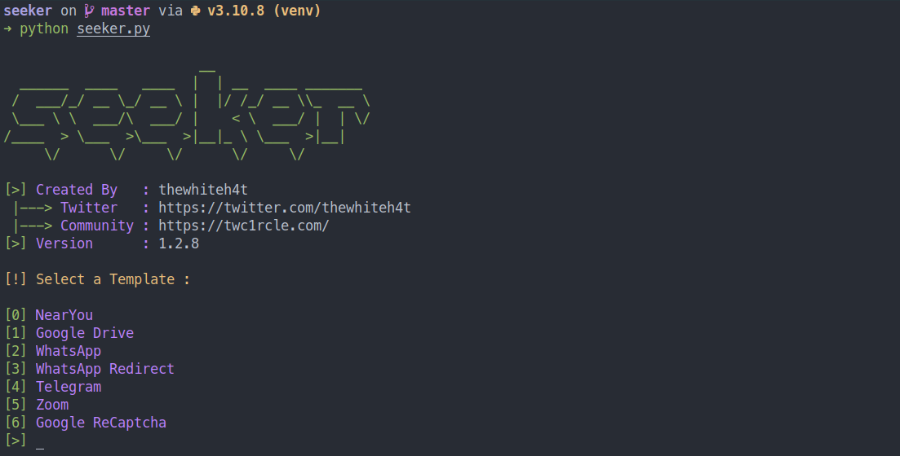

接下来就是选择钓鱼模板，默认为四选一。（更新：现在有了更多模板。）

> 模板根据实际情况进行选择或更改、制作

[0] NearYou: 

NearYou模板最简单，输入 0 回车即可。

<a data-fancybox="gallery" href="../assets/img/post/seeker/img17.png">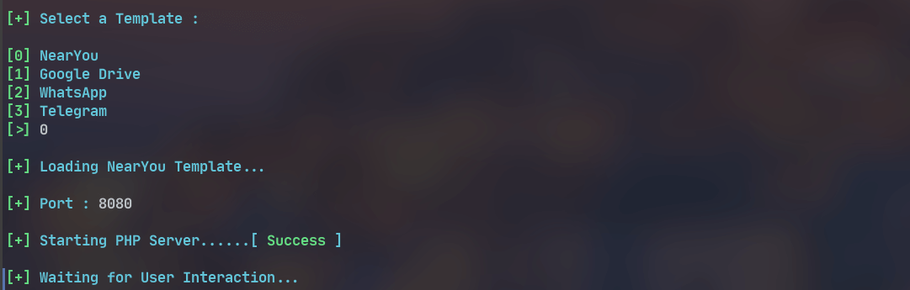

[1] Google Dirve: 

Google Drive 模板需要填一个URL，什么URL都行，不过填 Google Drive File 的 URL 更具欺骗性。

URL 的作用：钓鱼网页成功获取位置信息后跳转的正常网页。

<a data-fancybox="gallery" href="../assets/img/post/seeker/img03.png">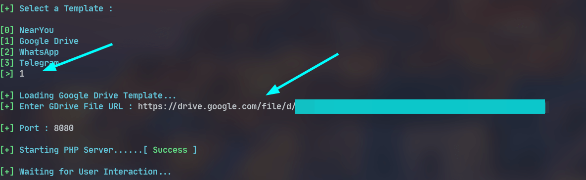

[2] WhatsApp: 

WhatsApp 模板需填入 Group Title 和 Group img。

<a data-fancybox="gallery" href="../assets/img/post/seeker/img12.png">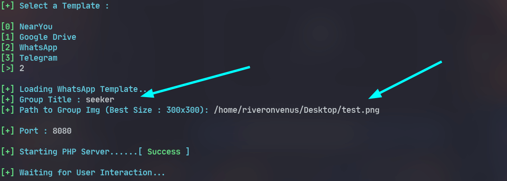

[3] Telegram: 

Telegram 同样需要填写一些群组信息。

<a data-fancybox="gallery" href="../assets/img/post/seeker/img14.png">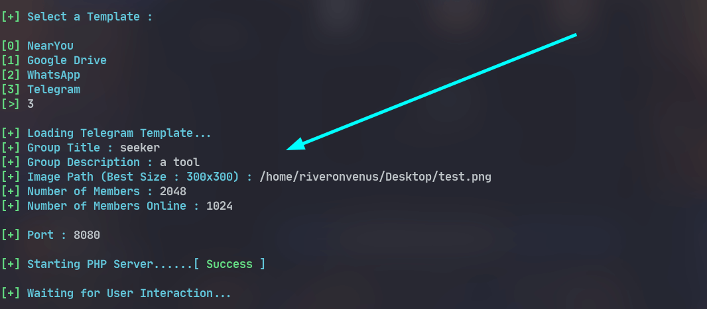

### 启动 ngrok

注：ngrok 现在需要注册账户才能使用，按照指引配置好 `ngrok.yml` 后即可使用。

```bash
➜ cat ~/.config/ngrok/ngrok.yml
version: "2"
authtoken: xxxxxxxxxxxxxxxxxxxxxxxxxxxxxxxxxxxxxxxxxxxxxxxxx
```

再开一个终端，启动 ngrok。

```bash
ngrok http 8080
```

<a data-fancybox="gallery" href="../assets/img/post/seeker/img04.png">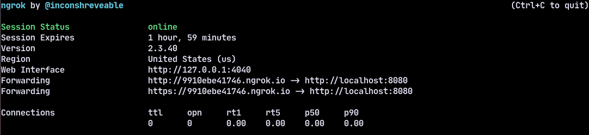

通过 ngrok 生成了2个 URL，选择其中一个发给目标，等待即可。

## 目标手机端

先看看在目标手机端打开链接会发生什么。

### 链接

在目标手机上用浏览器打开链接，看到的就是之前模板生成的钓鱼网页。

NearYou: 

<a data-fancybox="gallery" href="../assets/img/post/seeker/img18.png">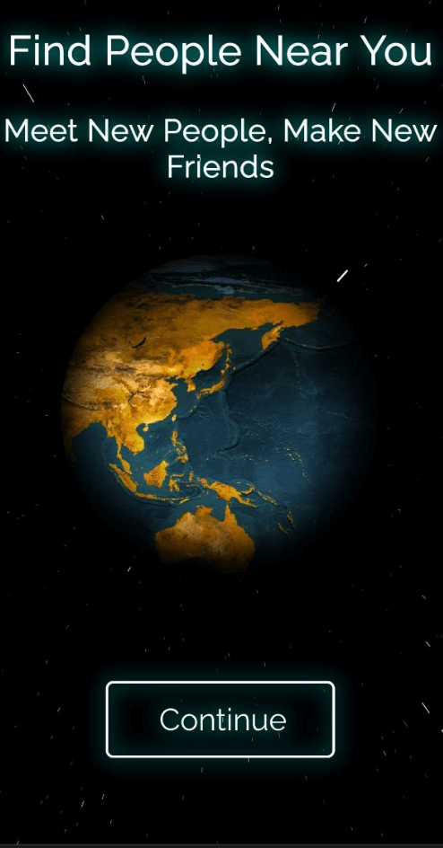

Google Dirve: 

<a data-fancybox="gallery" href="../assets/img/post/seeker/img16.png">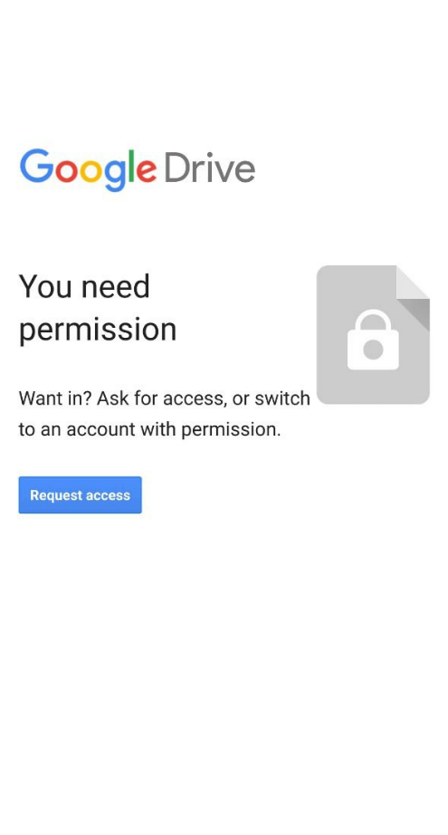

WhatsApp: 

<a data-fancybox="gallery" href="../assets/img/post/seeker/img13.png">

Telegram: 

<a data-fancybox="gallery" href="../assets/img/post/seeker/img15.png">

### 权限

若目标点击`CONTINUE`、`Request access`、`JOIN CHAT`、`VIEW IN TELEGRAM`则会弹出权限请求。

<a data-fancybox="gallery" href="../assets/img/post/seeker/img07.png">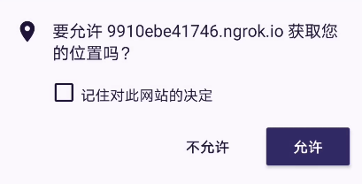

除 Google Drive 模板在点击允许后，会从的钓鱼网页进入到 Google Drive 的共享文件的 URL 界面外，其余三个模板均只有个弹窗并保持在钓鱼网页。

<a data-fancybox="gallery" href="../assets/img/post/seeker/img08.png">


在获取位置权限的事情上：

- NearYou 设计为 *Find People, Make Friends*，获取位置权限是可以被接受的。
- 其它模板获取位置权限较为生硬。
- Google Drive 在后来跳转到真实的共享文件，在一定程度上降低了可疑性。

至此，目标手机完成了以下过程：

1. 点开链接进入钓鱼网页
2. 允许钓鱼网页获取位置权限
3. 进入到 Google Drive 共享文件页面（或停留在钓鱼网页）

注：

> 若由于某些原因（如目标手机未开启 位置信息/GPS 功能等）钓鱼网页未能获取到位置信息，对于 Google Drive 模板则不会跳转到后面的url网页。

## 电脑端

回到电脑端，看看在目标手机点击链接时发生了什么。

### ngrok

当目标手机打开由 ngrok 生成的链接时，在 ngrok 界面可以看到相关的请求和响应。

<a data-fancybox="gallery" href="../assets/img/post/seeker/img05.png">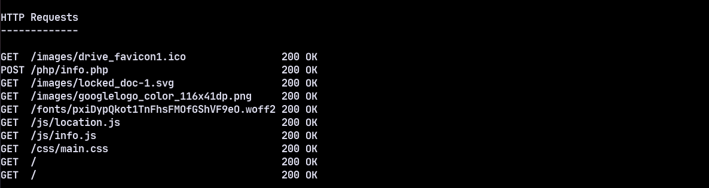

打开`http://127.0.0.1:4040`可以看到更详细的信息。

### seeker

当目标手机允许网站获取位置权限后，在 seeker 界面看到成功获取的信息。

<a data-fancybox="gallery" href="../assets/img/post/seeker/img19.png">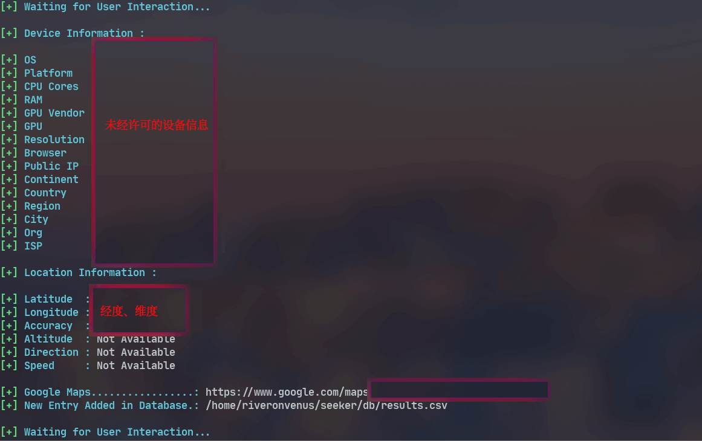

（图中相关隐私信息已做处理）

seeker 成功获取到了目标手机的`经度`、`维度`。点击`Google Maps链接`即可看到目标手机当前位置。除此之外，它还获取到了一些`未经许可的设备信息`。

**一般地，如果目标接受位置渗透，定位精度将精确到大约30米**。 

本次演示的定位精度为 40 米左右。

准确度取决于多种因素，如：

- 设备 - 在 GPS 损坏的笔记本电脑或手机上无法工作
- 浏览器 - 一些浏览器阻止了 javascripts
- GPS 校准 - 如果 GPS 没有被校准

# 视频演示


# 最后

这个工具是一个「概念证明」，仅用于教育目的，Seeker 显示了一个恶意网站可以收集关于你和你的设备的哪些数据，以及为什么你不应该点击未知链接和允许重要权限，如位置等。

# 参考资料

1. [https://github.com/thewhiteh4t/seeker](https://github.com/thewhiteh4t/seeker){:target="blank"}
