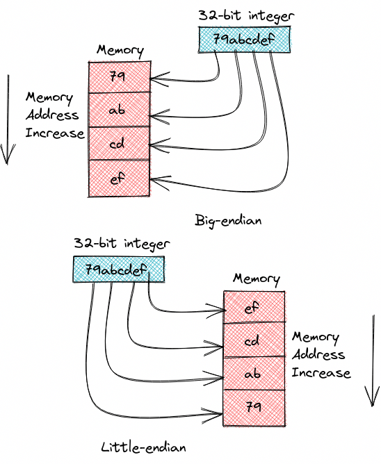

<a data-fancybox="gallery" href="../assets/img/post/endianness-little-endian-and-big-endian/samsung-memory-mDP3qpqLIh4-unsplash.jpg">

>Photo by <a href="https://unsplash.com/@samsungmemory?utm_source=unsplash&utm_medium=referral&utm_content=creditCopyText">Samsung Memory</a> on <a href="https://unsplash.com/?utm_source=unsplash&utm_medium=referral&utm_content=creditCopyText" >Unsplash</a>

*最后更新时间：Sat Nov 25 02:04:47 PM CST 2023*

## 0x00 什么是字节顺序

字节顺序，又称端序或尾序，在计算机科学领域中，指电脑内存中或在数字通信链路中，占内存多于一个字节类型的数据在内存中的存放顺序。 在几乎所有的机器上，多字节对象都被存储为连续的字节序列。例如在C语言中，在32位的环境下，一个类型为`int`的变量`x`地址为`0x79abcdef`，那么其对应地址表达式`&x`的值为`0x79abcdef`.

使用命令 `lscpu` 可以查看 cpu 的字节序。

```shell
lscpu | grep -i endian
```

输出：

```
Byte Order:                      Little Endian
```

字节序分为大端序和小端序，大端序是最高位字节`0x79` 存储在低的内存地址处，最低位字节`0xef`存储在高的内存地址处。小端序是最低位字节`0xef` 存储在低的内存地址处，最高位字节`0x79`存储在高的内存地址处。

<a data-fancybox="cpu-schedulers" href="../assets/img/post/endianness-little-endian-and-big-endian/endianess.png">

## 0x01 大小端的转换

最简单的方法是用`__builtin_bswap32`函数

```c
#include <inttypes.h>
#include <stdio.h>

int main() {
    uint32_t le = 0x79abcdef;
    uint32_t be = __builtin_bswap32(le);

    printf("Little-endian: 0x%" PRIx32 "\n", le);
    printf("Big-endian:    0x%" PRIx32 "\n", be);

    return 0;
}

```

输出：

```
Little-endian: 0x79abcdef
Big-endian:    0xefcdab79
```

`__builtin_bswap32` 是 [GCC内置函数](https://gcc.gnu.org/onlinedocs/gcc/extensions-to-the-c-language-family/other-built-in-functions-provided-by-gcc.html#_CPPv417__builtin_bswap328uint32_t)。

> - Built-in Function: *uint16_t* **__builtin_bswap16** *(uint16_t x)*
>
>   Returns x with the order of the bytes reversed; for example, `0xaabb` becomes `0xbbaa`.  Byte here always means exactly 8 bits.
>
> - Built-in Function: *uint32_t* **__builtin_bswap32** *(uint32_t x)*
>
>   Similar to `__builtin_bswap16`, except the argument and return types are 32-bit.
>
> - Built-in Function: *uint64_t* **__builtin_bswap64** *(uint64_t x)*
>
>   Similar to `__builtin_bswap32`, except the argument and return types are 64-bit.
>
> - Built-in Function: *uint128_t* **__builtin_bswap128** *(uint128_t x)*
>
>   Similar to `__builtin_bswap64`, except the argument and return types are 128-bit.  Only supported on targets when 128-bit types are supported.

在网络编程中，通常使用 `uint32_t htonl(uint32_t hostlong)` , `uint16_t htons(uint16_t hostshort)` , `uint32_t ntohl(uint32_t netlong)` , `uint16_t ntohs(uint16_t netshort)`在网络和主机之间进行大小端的转换。

## 参考资料

1. [https://stackoverflow.com/questions/19275955/convert-little-endian-to-big-endian](https://stackoverflow.com/questions/19275955/convert-little-endian-to-big-endian)
2. [https://gcc.gnu.org/onlinedocs/gcc/extensions-to-the-c-language-family/other-built-in-functions-provided-by-gcc.html](https://gcc.gnu.org/onlinedocs/gcc/extensions-to-the-c-language-family/other-built-in-functions-provided-by-gcc.html)

