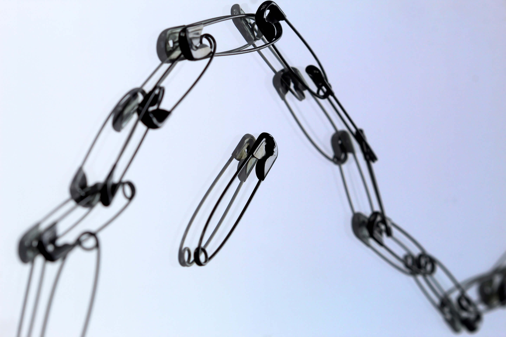

<a data-fancybox="cpu-schedulers" href="../assets/img/post/link-queue/anne-nygard-Sl69Jw-o0rU-unsplash.jpg">

>Photo by <a href="https://unsplash.com/@polarmermaid?utm_source=unsplash&utm_medium=referral&utm_content=creditCopyText" target="_blank">Anne Nygård</a> on <a href="https://unsplash.com/s/photos/queue?utm_source=unsplash&utm_medium=referral&utm_content=creditCopyText" target="_blank">Unsplash</a>

# 链式队列

队列，一种抽象数据类型，是先进先出（FIFO, First-In-First-Out）的线性表。通常用链表或者数组来实现。队列只允许在后端（称为rear）进行插入操作，在前端（称为front）进行删除操作。

下面是有头结点的链式队列，使用链表作为基本数据结构，所以不存在伪溢出的问题，队列长度也没有限制。但插入和读取的时间代价较高。

结构体定义

```c
//队列链式存储结构
typedef struct link_node {
    int value;
    struct link_node *next;
} link_node; //队列结点

typedef struct {
    link_node *front, *rear; //队列头尾指针
} link_queue;
```

初始化

```c
void init_queue(link_queue *Q) {
    Q->front = Q->rear = (link_node *) malloc(sizeof(link_node)); //头结点
    Q->front->next = NULL;
}
```

判断队列是否为空

```c
void is_empty(link_queue Q) {
    if (Q.front == Q.rear)
        printf("队列为空！\n");
    else
        printf("队列不为空！\n");
}
```

入队

```c
void en_queue(link_queue *Q, int value) {
    link_node *ptr = (link_node *) malloc(sizeof(link_node));
    ptr->value = value;
    ptr->next = NULL;
    Q->rear->next = ptr;
    Q->rear = ptr;
    ptr = NULL;
    printf("%d 入队成功\n", value);
}
```

出队

```c
void de_queue(link_queue *Q) {
    if (Q->front == Q->rear) {
        printf("队列为空！\n");
        return;
    }
    link_node *ptr = Q->front->next;
    int value = ptr->value;
    Q->front->next = ptr->next;
    if (Q->rear == ptr)
        Q->rear = Q->front; //若队列只有一个结点，删除后队列需置空
    printf("%d 出队成功\n", value);
    free(ptr);
}
```

打印队列中的元素

```c
void print_queue(link_queue Q) {
    Q.front = Q.front->next;
    printf("当前队列中有：");
    while (Q.front != NULL) {
        printf("%-3d", Q.front->value);
        Q.front = Q.front->next;
    }
    printf("\n");
}
```

完整代码

```c
/**
 * @file link_queue.c
 * @author zhui (RiverOnVenus)
 * @brief 基于链表的队列
 * @version 0.1
 * @date 2021-06-22
 * 
 * @copyright Copyright (c) 2021
 * 
 */

#include <stdio.h>
#include <stdlib.h>

typedef struct link_node {
    int value;
    struct link_node *next;
} link_node;

typedef struct {
    link_node *front, *rear;
} link_queue;

void init_queue(link_queue *Q) {
    Q->front = Q->rear = (link_node *) malloc(sizeof(link_node));
    Q->front->next = NULL;
}

void is_empty(link_queue Q) {
    if (Q.front == Q.rear)
        printf("队列为空！\n");
    else
        printf("队列不为空！\n");
}

void en_queue(link_queue *Q, int value) {
    link_node *ptr = (link_node *) malloc(sizeof(link_node));
    ptr->value = value;
    ptr->next = NULL;
    Q->rear->next = ptr;
    Q->rear = ptr;
    ptr = NULL;
    printf("%d 入队成功\n", value);
}

void de_queue(link_queue *Q) {
    if (Q->front == Q->rear) {
        printf("队列为空！\n");
        return;
    }
    link_node *ptr = Q->front->next;
    int value = ptr->value;
    Q->front->next = ptr->next;
    if (Q->rear == ptr)
        Q->rear = Q->front;
    printf("%d 出队成功\n", value);
    free(ptr);
}

void print_queue(link_queue Q) {
    Q.front = Q.front->next;
    printf("当前队列中有：");
    while (Q.front != NULL) {
        printf("%-3d", Q.front->value);
        Q.front = Q.front->next;
    }
    printf("\n");
}

int main() {
    link_queue Q;

    init_queue(&Q);

    is_empty(Q);

    en_queue(&Q, 1);
    en_queue(&Q, 2);
    en_queue(&Q, 3);
    en_queue(&Q, 4);
    en_queue(&Q, 5);

    print_queue(Q);

    de_queue(&Q);
    de_queue(&Q);

    print_queue(Q);

    return 0;
}

```

运行结果

```
队列为空！
1 入队成功
2 入队成功
3 入队成功
4 入队成功
5 入队成功
当前队列中有：1  2  3  4  5  
1 出队成功
2 出队成功
当前队列中有：3  4  5  
```

# 顺序栈

栈，一种抽象数据类型，只允许在有序的线性资料集合的一端（称为栈顶）进行加入数据和移除数据的运算。因而按照后进先出（LIFO, Last In First Out）的原理运作，栈常用一维数组或链表来实现。

```c
/**
 * @file sequence_stack.c
 * @author zhui (RiverOnVenus)
 * @brief 基于数组的栈
 * @version 0.1
 * @date 2021-06-22
 * 
 * @copyright Copyright (c) 2021
 * 
 */

#include <stdio.h>
#include <stdbool.h>

#define MAXSIZE 30

//定义栈的结构体
typedef struct {
    int data[MAXSIZE];
    int top;
} sq_stack;

//初始化栈
void init_stack(sq_stack *S) {
    S->top = -1; // -1代表栈为空
}

//判断栈是否为空
bool is_empty(sq_stack S) {
    if (S.top == -1)
        return true;
    else
        return false;
}

//入栈
void push_stack(sq_stack *S, int x) {
    if (S->top == MAXSIZE - 1) { //判断是否栈满，避免越界
        return;
    }
    S->data[++S->top] = x;
    printf("%d 入栈成功！\n", x);
}

//获取栈顶元素
void get_top(sq_stack *S) {
    if (is_empty(*S)) {
        return;
    }
    printf("栈顶元素是：%d\n", S->data[S->top]);
}

//出栈
void pop_stack(sq_stack *S) {
    is_empty(*S);
    printf("%d 出栈成功！\n", S->data[S->top--]);

}

//打印
void print_stack(sq_stack S) {
    int i = 0;
    printf("当前栈中有：");
    while (S.data[i] != S.data[S.top + 1]) {
        printf("%d ", S.data[i]);
        i++;
    }
    get_top(&S);
}

int main() {
    sq_stack S;

    init_stack(&S);
    push_stack(&S, 1);
    push_stack(&S, 2);
    push_stack(&S, 3);
    push_stack(&S, 4);
    push_stack(&S, 5);
    push_stack(&S, 6);

    get_top(&S);

    pop_stack(&S);
    pop_stack(&S);
    pop_stack(&S);

    print_stack(S);

    return 0;
}

```

运行结果

```
1 入栈成功！
2 入栈成功！
3 入栈成功！
4 入栈成功！
5 入栈成功！
6 入栈成功！
栈顶元素是：6
6 出栈成功！
5 出栈成功！
4 出栈成功！
当前栈中有：1 2 3 栈顶元素是：3
```

