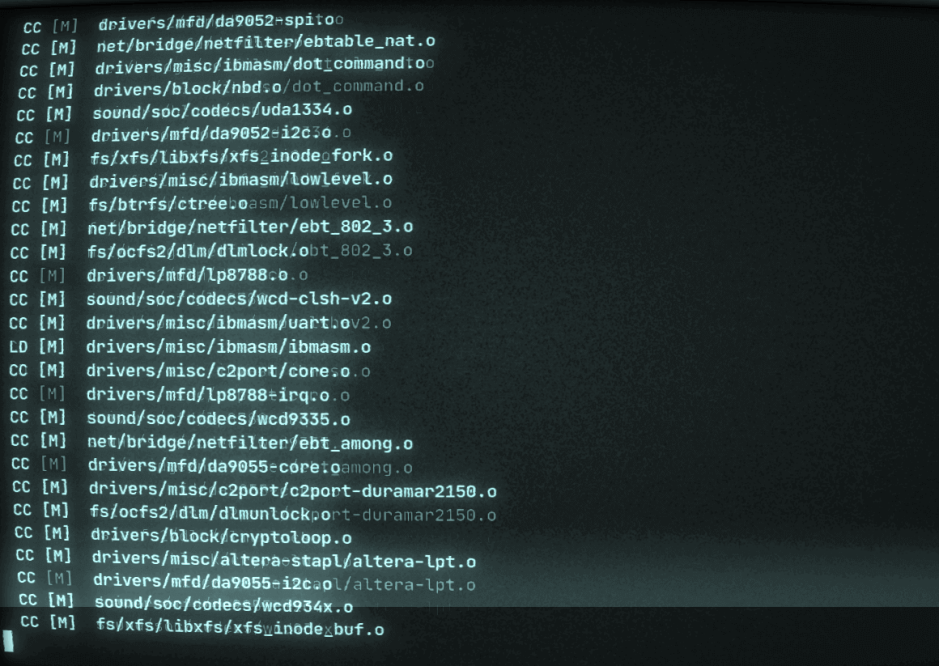

<a data-fancybox="gallery" href="../assets/img/post/kernels-cgproxy/image01.png">

 * TOC
{:toc}
## 前言

前段时间我一直在尝试不同的内核，想以此来提高桌面环境下的体验。官方支持的内核中我使用过 [linux-zen](https://archlinux.org/packages/?name=linux-zen){:target="blank"}, 非官方支持的内核中我使用过 [linux-ck](https://aur.archlinux.org/packages/linux-ck/){:target="blank"}, [linux-lqx](https://aur.archlinux.org/packages/linux-lqx/){:target="blank"}, [linux-xanmod](https://aur.archlinux.org/packages/linux-xanmod/){:target="blank"}, [linux-xanmod-cacule](https://aur.archlinux.org/packages/linux-xanmod-cacule/){:target="blank"}, [linux-cacule](https://aur.archlinux.org/packages/?K=linux-cacule){:target="blank"}。其中，使用 linux-zen, linux-ck时 cgproxy 正常，而使用其它几个内核时启动却出错，导致无法使用。

## 出错

在 Arch Linux 下我一直使用 [qv2ray](https://github.com/Qv2ray/Qv2ray){:target="blank"} + [cgproxy](https://github.com/springzfx/cgproxy){:target="blank"} 来使用代理，但在尝试不同内核时，我的网络崩掉了，然后发现 cgproxy 在一些内核下无法正常运行。

先查看服务状态`systemctl status cgproxy.service`:

```
● cgproxy.service - cgproxy service
     Loaded: loaded (/usr/lib/systemd/system/cgproxy.service; enabled; vendor preset: disabled)
     Active: active (running)
   Main PID: 472 (cgproxy)
      Tasks: 2 (limit: 9255)
     Memory: 5.4M
        CPU: 115ms
     CGroup: /system.slice/cgproxy.service
             └─472 /usr/bin/cgproxy --daemon --execsnoop

cgproxyd[472]: info: socketserver thread started
cgproxyd[472]: info: loading /usr/lib/cgproxy/libexecsnoop.so
cgproxyd[472]: info: dlsym startThread func success
cgproxyd[472]: libbpf: elf: skipping unrecognized data section(10) .eh_frame
cgproxyd[472]: libbpf: elf: skipping relo section(11) .rel.eh_frame for section(10) .eh_frame
cgproxyd[472]: libbpf: failed to determine tracepoint 'syscalls/sys_enter_execve' perf event ID: No such file or directory
cgproxyd[472]: libbpf: prog 'syscall_enter_execve': failed to create tracepoint 'syscalls/sys_enter_execve' perf event: No such file or directory
cgproxyd[472]: failed to attach BPF programs
cgproxyd[472]: error: execsnoop thread timeout, maybe failed
```

经过分析已有信息和对比各个内核的 config 以及最后测试，确定了是这些内核直接或间接禁用了 **CONFIG_FTRACE_SYSCALLS** 造成的。

## 解决

（最后更新时间 2021-08-20，由于内核更新较快，且 PKGBUILD 和 config 也会有所改变，所以以下方法可能过时，仅供参考）

编译内核时在 config 中启用 *CONFIG_FTRACE_SYSCALLS *或 *CONFIG_FTRACE* 即可解决。

- ~~对于linux-cacule系列的内核，将其PKGBUILD中禁用*CONFIG_FTRACE*的语句`scripts/config --disable CONFIG_FTRACE`注释掉或删掉以启用*CONFIG_FTRACE_SYSCALLS*~~
- (2021-08-20更新) 对于 linux-cacule 系列内核，在其 PKGBUILD 中加入两条语句`scripts/config --enable CONFIG_FTRACE`和 `scripts/config --enable CONFIG_FTRACE_SYSCALLS`以启用 *CONFIG_FTRACE_SYSCALLS*
- 对于 linux-lqx, 在其 PKGBUILD 中加入语句`scripts/config --enable CONFIG_FTRACE_SYSCALLS`以启用 *CONFIG_FTRACE_SYSCALLS*
- 对于 linux-xanmod 系列内核，在其 PKGBUILD 中加入两条语句`scripts/config --enable CONFIG_FTRACE`和 `scripts/config --enable CONFIG_FTRACE_SYSCALLS`以启用 *CONFIG_FTRACE_SYSCALLS*

## 最后

经过几个月的使用和测试，在我的工作负载下，这些内核给我的体验都很好，有的侧重于系统的吞吐量，有的侧重于系统的响应。鱼与熊掌不可兼得，获得更高的吞吐量往往以响应时间为代价，想要系统更快的响应也会牺牲吞吐量。
