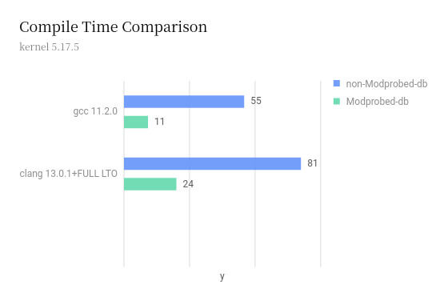
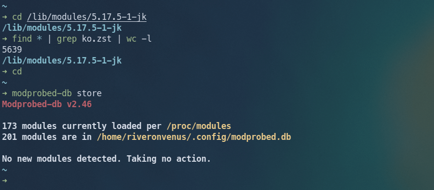

<a data-fancybox="modprobed-db" href="../assets/img/post/modprobed-db/image01.jpg"></a>

> Photo by <a href="https://unsplash.com/@aronvisuals?utm_source=unsplash&utm_medium=referral&utm_content=creditCopyText">Aron Visuals</a> on <a href="https://unsplash.com/?utm_source=unsplash&utm_medium=referral&utm_content=creditCopyText">Unsplash</a>

自从开始尝试自定义内核，便陷入其中。在内核方面，我是业余的，仅仅是在内核中打上一些我想使用的补丁以及简单修改一些配置。每当主线内核发布或有新的补丁时，我就会重新编译内核。就我的笔记本电脑来说，每次编译内核都会花费一个多小时的时间，而当我使用了Modprobed-db后，编译时间显著减少了。

# Modprobed-db是什么？

Modprobed-db是一个通过[make localmodconfig](https://www.kernel.org/doc/html/latest/admin-guide/README.html?highlight=localmodconfig#configuring-the-kernel){:target="blank"}建立最小内核的工具。它会根据你当前的config和由Modprobed-db生成的模块列表创建一个新的config，其余不需要的模块都将被它禁用。这样就得到了一个属于你的、精简的内核。

# 如何使用它呢？

## 安装和初始化配置

> 项目地址：**[graysky2/modprobed-db](https://github.com/graysky2/modprobed-db){:target="_blank"}**  

对于Arch Linux，安装[modprobed-db](https://aur.archlinux.org/packages/modprobed-db){:target="blank"}。

安装完后首先运行`modprobed-db`，它会创建Modprobed-db配置文件$XDG_CONFIG_HOME/modprobed-db.conf。

在~/.config/modprobed-db.conf中，可以添加你想忽略的模块。一些由其它软件包提供的模块需要添加进去，如Nvidia。

默认配置中包括了一些常见的、需要被忽略的模块：

```
IGNORE=(nvidia nvidia_drm nvidia_modeset nvidia_uvm vboxdrv vboxnetadp vboxnetflt vboxpci lirc_dev lirc_i2c osscore oss_hdaudio oss_usb tp_smapi thinkpad_ec zavl znvpair zunicode zcommon zpios zfs spl splat)
```

## 填充数据库

配置好modprobed-db.conf后，运行`modprobed-db store`，它会探测到当前加载的模块，并创建Modprobed-db数据库文件$XDG_CONFIG_HOME/modprobed.db，数据库文件是一个文本文件，其内容就是被探测到的模块列表。这个数据库文件是可以积累的，每次运行`modprobed-db store`都会记录下之前沒有出现过的模块。使用`modprobed-db list`可以显示当前数据库文件中的模块。

### 自动更新数据库

启用：

```
systemctl --user enable --now modprobed-db
```

modprobed-db.service每隔6小时运行一次`modprobed-db store`，在开机和关机时也会各运行一次。

service和timer可以用下面命令查看：

```
systemctl --user status modprobed-db
systemctl --user list-timers
```

### 手动编辑数据库

使用自动定期数据库更新或手动运行`modprobed-db store`并不是万无一失的。

- 有些模块在两次定期数据库更新之间被加载然后卸载，可能不会被捕获。
- 有些模块在启动时使用，不被modprobed-db捕获（如efivarfs），它们需要被手动添加到modprobed.db文件中。

前面提到过，modprobed.db数据库文件是一个简单的文本文件，每行包含一个内核模块名称：它可以被手动编辑以添加/删除一个模块，可以将自己要用的模块加入其中。在手动编辑后运行一次`modprobed-db store`，这些模块会自动重新排序。

下面是一些常用的模块，如果你的数据库中没有，可以对照着手动添加。

```
ntfs3
ext4
fat
vfat
loop
isofs
cifs
efivarfs
usb_storage
usbhid
bridge
```

在完善数据库后，就可以使用Modprobed-db来构建内核了。

## 使用Modprobed-db构建内核

对于[传统编译内核](https://wiki.archlinux.org/title/Kernel/Traditional_compilation){:target="blank"}的方式，在配置好.config后运行`make LSMOD=$HOME/.config/modprobed.db localmodconfig`就行。

如果使用Arch官方内核的[PKGBUILD](https://github.com/archlinux/svntogit-packages/blob/packages/linux/trunk/PKGBUILD){:target="blank"}构建内核，对PKGBUILD做以下更改：

```
...
  echo "Setting config..."
  cp ../config .config
  make olddefconfig
  
  make LSMOD=$HOME/.config/modprobed.db localmodconfig
  
  diff -u ../config .config || :

  make -s kernelrelease > version
  echo "Prepared $pkgbase version $(<version)"
 ...
```

# 那么，它减少了多少编译时间？

我的笔记本电脑CPU是Intel Core i5-8250U (8) @ 1.6GHz，4核8线程。

编译的内核是主线的5.17.5，config是Arch Linux默认内核的config。

使用gcc编译需要55m35s，使用clang编译同时启用FULL LTO需要1h21m57s；在使用Modprobed-db后，使用gcc编译需要11m50s，使用clang编译同时启用FULL LTO需要24m11s。

<a data-fancybox="modprobed-db" href="../assets/img/post/modprobed-db/image02.jpeg"></a>

为什么时间减少了这么多呢？因为一个正常的内核大概有5000多个模块，而modprobed-db数据库中就200个模块。

<a data-fancybox="modprobed-db" href="../assets/img/post/modprobed-db/image03.png"></a>

内核构建大部分时间花费在了模块上，而其中许多模块也用不到。

# 一些经验和建议

如果使用dkms需要将对应模块放入到忽略模块列表中，如bbswitch，acpi_call等。

将需要加载内核模块的程序都运行一下，以及插入USB等设备，然后运行`modprobed-db store`完善数据库。

在当前使用的内核上使用一段时间Modprobed-db后，再用它编译内核。

使用Modprobed-db构建最小内核是有风险的，记得选择一个稳定的内核备用。
