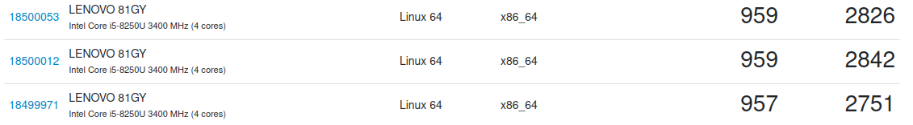

<a data-fancybox="cpu-schedulers" href="../assets/img/post/linux-cpu-schedulers/luis-gonzalez-jgzdwJWCPDI-unsplash.jpg">

>Photo by <a href="https://unsplash.com/@luchox23?utm_source=unsplash&utm_medium=referral&utm_content=creditCopyText" target="_blank">Luis Gonzalez</a> on <a href="https://unsplash.com/s/photos/ryzen?utm_source=unsplash&utm_medium=referral&utm_content=creditCopyText" target="_blank">Unsplash</a>

*最后更新时间：Sat Dec 10 11:13:09 AM CST 2022*

对于各种 CPU 调度器，很多人的看法和得到的反馈不一样。有的人想要“压榨” CPU 的性能，将其发挥到极致，他们通常会因为某个调度器带来的一点点性能提升而高兴；有的人真实的感受到了在高负载环境下系统的响应能力提升；有的人对此嗤之以鼻；有的人无所谓这点性能或响应能力；有的人在不同调度器上得到了负优化；有的人......

下面这些是我目前了解到的 CPU 调度器。BFS 和 MuQSS 曾经都是由 Con Kolivas 开发维护，但两者现在都处于无人维护的状态。Baby, CacULE 和 TT 都是由 Hamad Al Marri 开发维护，其中 Baby 是让 CPU 调度器爱好者学习用的，在 CK 宣布[放弃维护 MuQSS](https://ck-hack.blogspot.com/2021/08/514-and-future-of-muqss-and-ck-once.html){:target="blank"} 后，Hamad 也随后放弃维护 CacULE, 两个月后 Hamad 发布了新的 CPU 调度器--TT, 由于精力有限，他只维护 TT 的 LTS 版本 。Bore 是在 CFS 上进行一些修改，由 mu(Masahito Suzuki) 开发维护。BMQ 和 PDS 现在都属于 Project C, 由 Alfred Chen 开发维护。

- [Baby](https://github.com/hamadmarri/Baby-CPU-Scheduler){:target="blank"} - A very basic and lightweight yet very performant CPU scheduler. Can be used for learning purposes as a base ground CPU scheduler on Linux.
- [BFS](https://www.phoronix.com/scan.php?page=search&q=Brain+Fuck+Scheduler){:target="blank"} - BFS (Brain Fuck Scheduler) is a process scheduler designed for the linux kernel as an alternative to the Completely Fair Scheduler.
- [BMQ](https://gitlab.com/alfredchen/linux-prjc){:target="blank"} - BMQ (BitMap Queue) is a linux CPU scheduler, inspired By Google's Zircon.
- [Bore](https://github.com/firelzrd/bore-scheduler){:target="blank"} - BORE (Burst-Oriented Response Enhancer) is a modification to the Completely Fair Scheduler, the Linux default CPU scheduler.
- [CacULE](https://github.com/hamadmarri/cacule-cpu-scheduler){:target="blank"} - The CacULE CPU scheduler is based on interactivity score mechanism. The interactivity score is inspired by the ULE scheduler (FreeBSD scheduler).
- [CFS](https://www.kernel.org/doc/html/latest/scheduler/sched-design-CFS.html){:target="blank"} - CFS (Completely Fair Scheduler) is the new desktop process scheduler implemented in Linux 2.6.23 as a replacement for the previous vanilla scheduler’s SCHED_OTHER interactivity code. It is the current linux task scheduler.
- [MuQSS](http://ck.kolivas.org/patches/muqss/sched-MuQSS.txt){:target="blank"} - Multiple Queue Skiplist Scheduler (MuQSS) is a rewritten implementation of the Brain Fuck Scheduler (BFS) concept.
- [PDS](https://gitlab.com/alfredchen/linux-prjc){:target="blank"} - PDS (Priority and Deadline based Skiplist multiple queue scheduler) is a linux CPU scheduler whose design principles are to be a simple CPU process scheduler yet efficient and scalable.
- [TT](https://github.com/hamadmarri/TT-CPU-Scheduler){:target="blank"} - The goal of the Task Type (TT) scheduler is to detect tasks types based  on their behaviours and control the schedulling based on their types.

（按照字母排序）

这些调度器是否真的对性能或响应有改善呢？

# 测试

**系统信息**

```
Operating System: Arch Linux
KDE Plasma Version: 5.26.2
KDE Frameworks Version: 5.99.0
Graphics Platform: X11
Manufacturer: LENOVO
Product Name: 81GY
System Version: Lenovo XiaoXin Air 15IKBR
```

**CPU 信息**

```
Name: 	Intel Core i5-8250U
Topology: 	1 Processor, 4 Cores, 8 Threads
Base Frequency: 	3.40 GHz
L1 Instruction Cache:	32.0 KB x 4
L1 Data Cache:	32.0 KB x 4
L2 Cache:	256 KB x 4
L3 Cache:	6.00 MB x 1
```

**内核信息**

Arch Linux [默认内核](https://github.com/archlinux/linux){:target="blank"}加不同的调度器。

内核版本：6.0.7

**测试方法**

使用 [geekbench v5](https://www.geekbench.com/){:target="blank"} 对 CPU 进行性能测试。

使用 [jitterdebugger](https://github.com/igaw/jitterdebugger){:target="blank"} 配合 [stress-ng](https://github.com/ColinIanKing/stress-ng){:target="blank"} 对 CPU 进行响应测试。

**性能测试**

进行3次 geekbench 测试，取平均数。

```
geekbench
```

**响应测试**

用 jitterdebugger 模拟交互任务，用 'stress-ng --cpu 24' 模拟 CPU 高负载工作环境，测量10分钟。

```
jitterdebugger -D 10m -c 'stress-ng --cpu 24'
```

将测量的结果生成直方图。

- 纵轴为次数，横轴为时间（μs）
- min: 观察到的最小的唤醒延迟
- max: 观察到的最大的唤醒延迟
- avg: 所有观察到的唤醒延迟的算术平均值

## BMQ

geekbench:

<a data-fancybox="cpu-schedulers" href="../assets/img/post/linux-cpu-schedulers/BMQ-geekbench.png"></a>

平均分：Single-Core: 960.66, Multi-Core: 2934.66

延迟直方图：

<a data-fancybox="cpu-schedulers" href="../assets/img/post/linux-cpu-schedulers/BMQ-plot.png"></a>

## Bore

geekbench:

<a data-fancybox="cpu-schedulers" href="../assets/img/post/linux-cpu-schedulers/Bore-geekbench.png"></a>

平均分：Single-Core: 958, Multi-Core: 2806.33

延迟直方图：

<a data-fancybox="cpu-schedulers" href="../assets/img/post/linux-cpu-schedulers/Bore-plot.png"></a>


## CacULE

<a data-fancybox="cpu-schedulers" href="../assets/img/post/linux-cpu-schedulers/CacULE-geekbench.png"></a>

平均分：Single-Core: 959.66, Multi-Core: 2908.33

延迟直方图：

<a data-fancybox="cpu-schedulers" href="../assets/img/post/linux-cpu-schedulers/BMQ-geekbench.png"></a>

## CFS

6.0 CFS 与 5.15 CFS 相比，前者真的得到了改善。

<a data-fancybox="cpu-schedulers" href="../assets/img/post/linux-cpu-schedulers/CFS-geekbench.png"></a>

平均分：Single-Core: 959, Multi-Core: 2919

延迟直方图：

<a data-fancybox="cpu-schedulers" href="../assets/img/post/linux-cpu-schedulers/CFS-plot.png"></a>

## PDS

<a data-fancybox="cpu-schedulers" href="../assets/img/post/linux-cpu-schedulers/PDS-geekbench.png"></a>

平均分：Single-Core: 959, Multi-Core: 2948.33

延迟直方图：

<a data-fancybox="cpu-schedulers" href="../assets/img/post/linux-cpu-schedulers/PDS-plot.png"></a>

## TT--CFS

这里 TT 使用的是 CFS balancer

<a data-fancybox="cpu-schedulers" href="../assets/img/post/linux-cpu-schedulers/TT-geekbench.png"></a>

平均分：Single-Core: 957, Multi-Core: 2905

延迟直方图：

<a data-fancybox="cpu-schedulers" href="../assets/img/post/linux-cpu-schedulers/TT-plot.png"></a>

# 测量结果分析

从数据上来看：

- 单核性能：BMQ > CacULE > CFS = PDS > Bore > TT--CFS

- 多核性能：PDS > BMQ > CFS > CacULE > TT--CFS > Bore

- 响应能力：BMQ > PDS > TT--CFS > CacULE > Bore > CFS

[这里](https://browser.geekbench.com/user/445125){:target="blank"} 可以看到 geekbench 所有的测试结果，和更详细的系统信息。

# 实际使用感受

在高负载的环境下，BMQ 和 TT--CFS 很丝滑（确信这不是心理作用:joy:），PDS 会有一些明显的卡顿。另外3个则是介于「很丝滑」和「明显卡顿」之间，它们之间实在是没感受都差异。当高负载达到某个程度时，BMQ会冻结桌面。而吞吐方面，区别不大。

BMQ 在大多数 AMD 设备上很差劲，甚至会导致冻结桌面，但是在一些 intel 设备上表现的很好。 Bore 的重点是在高负载环境下提供更低的延迟，有更好的响应，它是在 CFS 上进行了一些修改，吞吐方面与 CFS 几乎一样。BMQ/PDS 大多不适合多任务负载，Bore/TT--CFS 在高负载（编译、渲染）下的体验要比它们好得多。

注：不同的 CPU 调度器在不同的硬件上的表现存在差异。

# 2022-12-03 更新

在 6.0.11 内核上再次对 Bore, CFS, TT--CFS 进行测试。

测试方法和上面基本相同。

但响应测试加大了负载，改为了：

```
jitterdebugger -D 10m -c 'stress-ng --cpu-method loop -c 256'
```

## Bore 1.7.3

<a data-fancybox="cpu-schedulers" href="../assets/img/post/linux-cpu-schedulers/Bore-geekbench-2.png">

平均分：Single-Core: 957, Multi-Core: 2949.33

延迟直方图：

<a data-fancybox="cpu-schedulers" href="../assets/img/post/linux-cpu-schedulers/BORE-plot-256.png">

## CFS

<a data-fancybox="cpu-schedulers" href="../assets/img/post/linux-cpu-schedulers/CFS-geekbench-2.png">

平均分：Single-Core: 957.66, Multi-Core: 2909.33

延迟直方图：

<a data-fancybox="cpu-schedulers" href="../assets/img/post/linux-cpu-schedulers/CFS-plot-256.png">

## TT--CFS

<a data-fancybox="cpu-schedulers" href="../assets/img/post/linux-cpu-schedulers/TT-geekbench-2.png">

平均分：Single-Core: 958.66, Multi-Core: 2878.66

延迟直方图：

<a data-fancybox="cpu-schedulers" href="../assets/img/post/linux-cpu-schedulers/TT-plot-256.png">

## 测量结果

- 单核性能：TT--CFS > CFS > Bore
- 多核性能：Bore > CFS > TT--CFS
- 响应能力：TT--CFS > Bore > CFS

Bore 在最近发布的版本上 ( >= 1.7.x) 做了很多改进，正如它的作者所说，Bore 的吞吐明显有了提高，响应略微高于 CFS，测量结果也验证了这一点。Bore 的单次多核分数达到了 2953 (这是这台机器上目前测量到的最高分数，在上一次测量中 PDS 最高也达到了 2953)。在响应方面 TT 仍然表现最好，它的吞吐量较低也在意料之中。CFS 倒是没有明显的变化。

另外，BMQ 在本次测量响应时冻结了桌面，可能是负载过大造成的。

同样，[这里](https://browser.geekbench.com/user/445125){:target="blank"} 可以看到 geekbench 所有的测试结果。

# Q&A

下面是节选的一些有参考价值的问答:speech_balloon:

:one:

Q:

> Which best scheduler of them?

A:

> It's the same old saying: Test against your workload

:two:

Q:

> Unexpectedly about the TT. I.e. it's the best for the desktop right now, but still in the support stage?

A:

> Yes, so far possible. The project is from Hamad, so far I understood he is maybe working again on some updates someday.
>
> You cant say the best to anything, it have to suit to your needs, if its cfs, bore,tt,cacule or pds. But so far it showed that TT runs better on older hardware.

:three:

Q:

> Sorry I am sounding ignorant.
> If a scheduler is giving better results.
> Why would someone use the other one?
> Or is it that every kernel specialises in something?
>
> How do you deem a scheduler to be best for the majority?

A:

> Thank you for questioning.
> I say with my greatest respect to Hamad Al Marri, Alfred Chen, Con Kolivas, Ingo Molnar and other great scheduler developers,
> BORE is not "the best for any possible use."
> In fact, NO scheduler is known to be "always best for anything," despite all the developers are eagerly trying to create one that is.
> For some computing demands TT is obviously known to be the best.
> For some other workloads, BMQ or PDS-mq may work better.
> Similar that you may find the RT kernel useful to your needs, when some others prefer Voluntary preemption kernel.
> It is encouraged to find by yourself your best choice.
> Thank you, and thank you all guys here for sharing the joy.

完。
