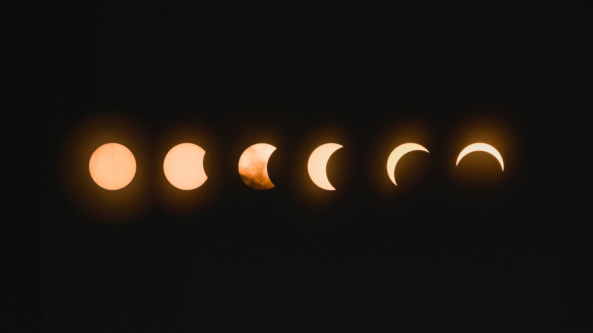

<a data-fancybox="ku-zhou-duan" href="../assets/img/post/ku-zhou-duan/mark-tegethoff-NbgQfUvKFE0-unsplash.jpg">

> Photo by <a href="https://unsplash.com/@tegethoff?utm_source=unsplash&utm_medium=referral&utm_content=creditCopyText" target="_blank">Mark Tegethoff</a> on <a href="https://unsplash.com/?utm_source=unsplash&utm_medium=referral&utm_content=creditCopyText" target="_blank">Unsplash</a>

飞光，飞光，劝尔一杯酒。

吾不识青天高、黄地厚，

唯见月寒日暖，来煎人寿。

食熊则肥，食蛙则瘦。

神君何在？太一安有？

天东有若木，下置衔烛龙。

吾将斩龙足、嚼龙肉，

使之朝不得回、夜不得伏。

自然老者不死、少者不哭。

何为服黄金、吞白玉？

谁似任公子，云中骑碧驴？

刘彻茂陵多滞骨，嬴政梓棺费鲍鱼。
