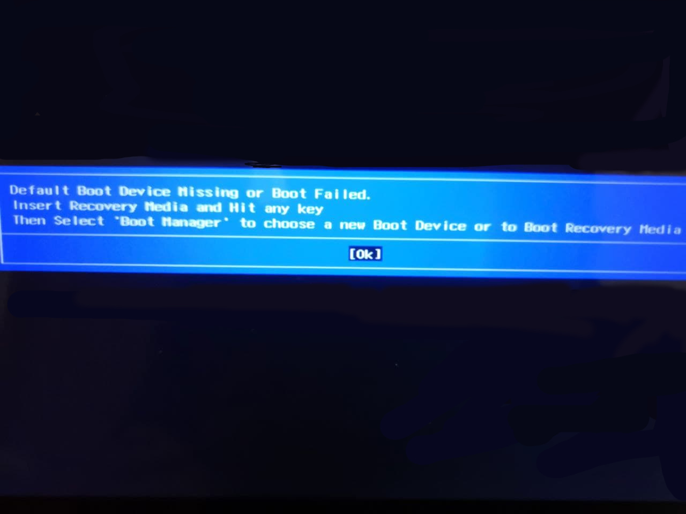
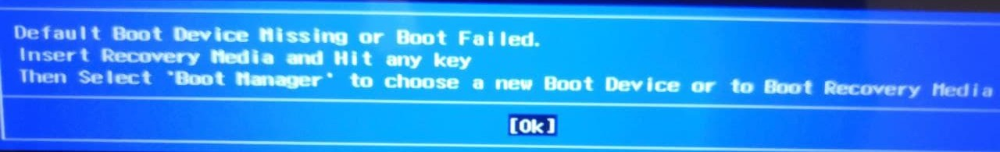
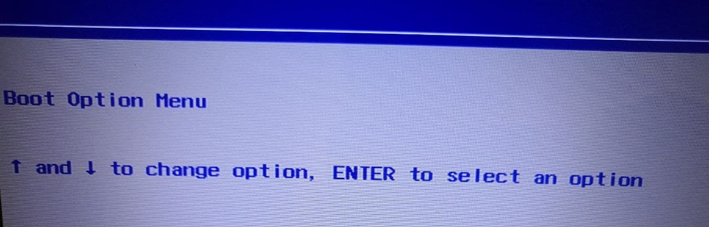
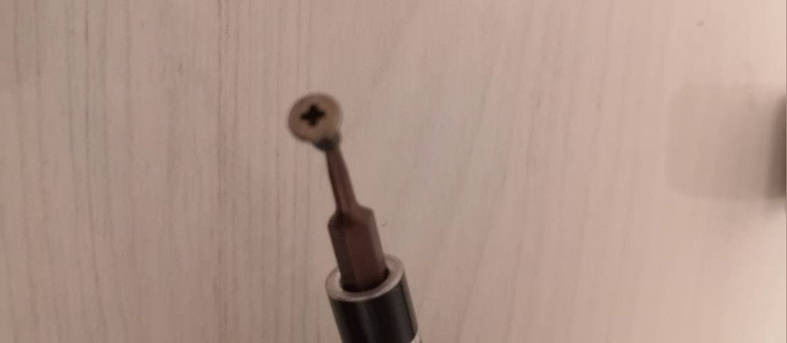
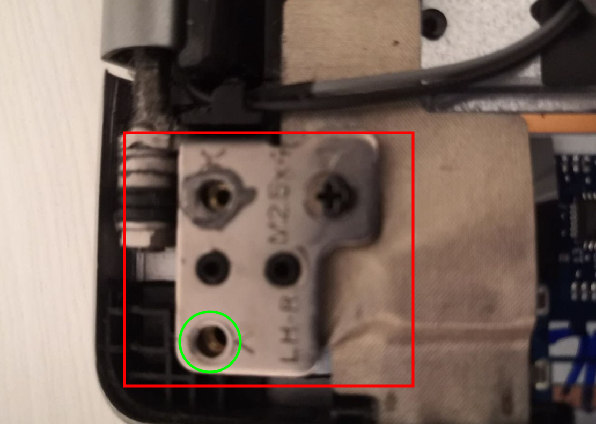
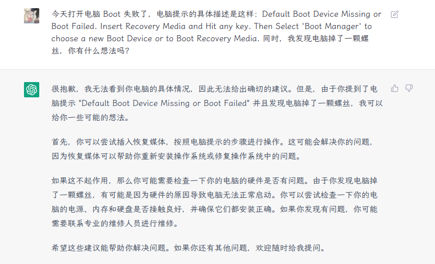
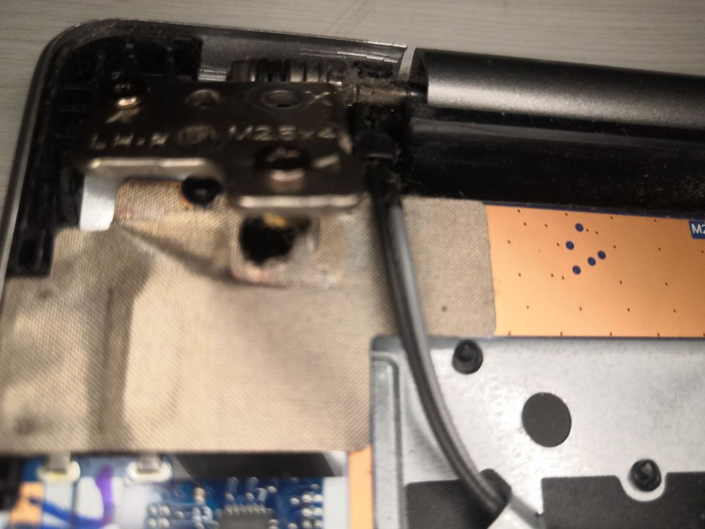
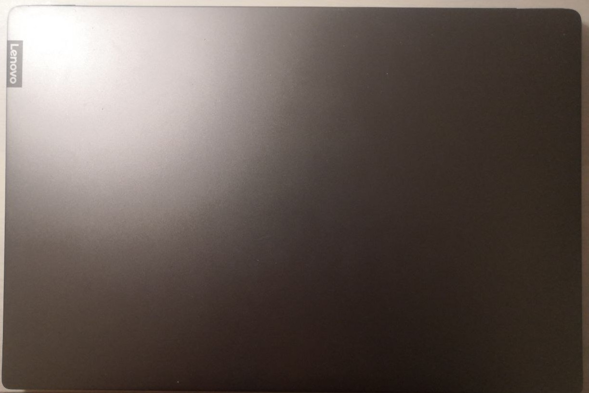
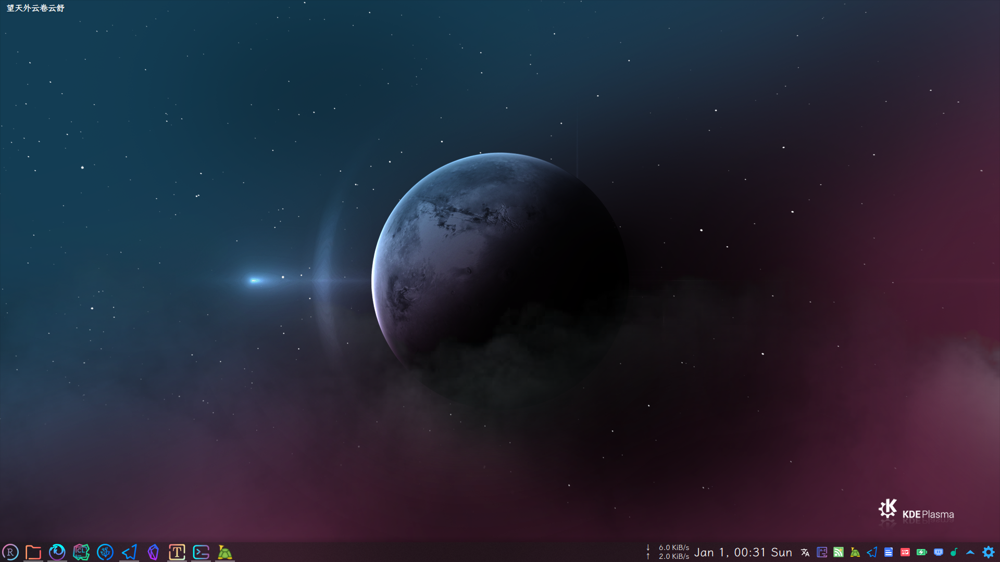

<a data-fancybox="gallery" href="../assets/img/post/my-old-buddy/img00.jpg">

本来是开开心心的清灰，结果差点悲剧了。

这天听朋友说他要给他的电脑清灰，我想我的电脑也该清灰了，上一次清灰好像是一年半之前了。于是在晚上饭点前，我拆开后盖，清灰，装上后盖，一气呵成。开机（这里开机只是把后盖合上没有拧螺丝），一切正常，关机，拧完螺丝，就去吃饭了。

吃完饭回来，看见一颗螺丝在那里孤独的侧躺着，这时候我还没意识到问题的严重性，以为这是我工具包里漏的，因为清灰过程中根本没有碰过这种螺丝，而且刚刚开机没有任何问题，我甚至想着就算它是电脑里也不怕，反正电脑一切正常。

按电源，启动电脑，开机过程中我开始意识到有些不对劲，果然，他出问题了。

> Default Boot Device Missing or Boot Failed.
>
> Insert Recovery Media and Hit any key
>
> Then Select 'Boot Manager' to choose a new Boot Device or to Boot Recovery Media

凡事不要慌，拍个照先。

<a data-fancybox="gallery" href="../assets/img/post/my-old-buddy/img01.jpg">

回车。

<a data-fancybox="gallery" href="../assets/img/post/my-old-buddy/img02.jpg">

Boot menu 空空如也。

好吧，我意识到那颗孤独的螺丝不简单，于是我把它拿出来仔细看了一下:facepunch:

<a data-fancybox="gallery" href="../assets/img/post/my-old-buddy/img03.jpg">

再次拆开后盖，打着手电，一处一处的找，没看见什么地方有问题。

这时我想到刚才没拧螺丝时是能正常开机的，于是打算情景再现，万一他好了呢。

合上后盖（没用螺丝固定），拿在手里打开屏幕，这一开直接开出另一个问题了，这红框里的一坨翘起来了，大概和水平面的夹角有 30 度。右上角那颗螺丝在没有拧松的情况下被强制脱离了螺口。

<a data-fancybox="gallery" href="../assets/img/post/my-old-buddy/img04.png">

这时我慌了一下，以为他要卒。（30 度的时候没拍照）

也不知道怎么想的，我直接把翘起来这一坨按回去了。按回去后我发现这里有个孔（绿圈）和那颗孤独的螺丝很吻合，而这一坨在另一边也有一样的另一坨，它两是一样的结构，可以确定那颗孤独的螺丝就是这里掉的。

抱着试一试的心态把之前那颗孤独的螺丝拧好，同时把另一颗螺丝也紧了紧。

然后合上后盖，上了两颗固定后盖的螺丝，开机，他好了:smile:

上完剩下的螺丝，再反复的重启，在 arch/win 来回切换几次，好像真的没什么问题了。

所以大概是螺丝的问题。

事后我想到最近用的 ChatGPT, 它的回答时而让人眼前一亮，时而呆得一比，想看看它怎么说。

<a data-fancybox="gallery" href="../assets/img/post/my-old-buddy/img05.png">

……

倒是有点担心那一坨某天会搞事情，因为是我不正确的开合方式导致的，就像是暴力掰开的一样。

也许那一坨根本不涉及电路……

---

第二天，我越想这事越觉得不对。

首先那一坨应该是转轴，可是转轴掉一颗螺丝或者脱离了接口会导致 Boot 失败吗？不会。

实践是检验真理的唯一标准。

说干就干，关机，开后盖，情景再现。

先拆掉这件事的引子——那颗孤独的螺丝，然后开机，一切正常。所以，可以否定之前的结论了。

同样的操作再次让转轴脱离，像这样。

<a data-fancybox="gallery" href="../assets/img/post/my-old-buddy/img06.jpg">

<a data-fancybox="gallery" href="../assets/img/post/my-old-buddy/img07.jpg">

<a data-fancybox="gallery" href="../assets/img/post/my-old-buddy/img08.jpg">

开机，依然是一切正常。

结论：这次 Boot 失败和那颗孤独的螺丝无关，和转轴无关。

……

那 Boot 失败是因为什么呢？

猜测：和硬盘有关。

……

给他照个相吧，也许哪天就一觉不醒呢……我的老伙计……

<a data-fancybox="gallery" href="../assets/img/post/my-old-buddy/img09.jpg">

<a data-fancybox="gallery" href="../assets/img/post/my-old-buddy/img10.png">

> 陪伴了我 4 年 4 个月的 Lenovo XiaoXin Air 15IKBR
