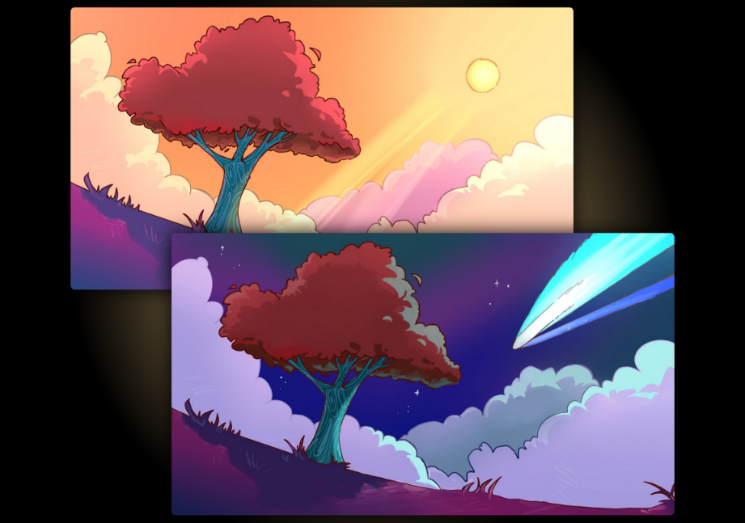
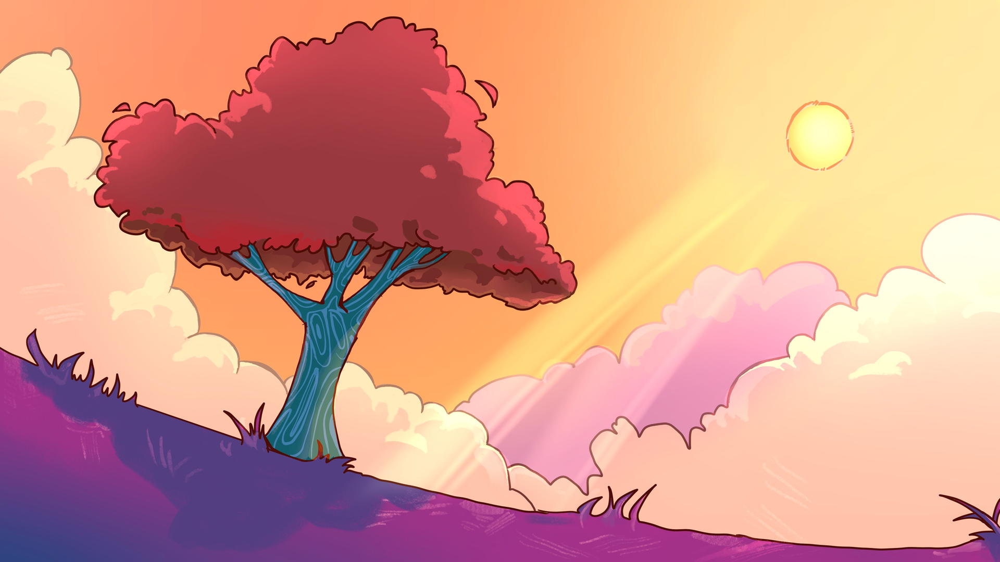
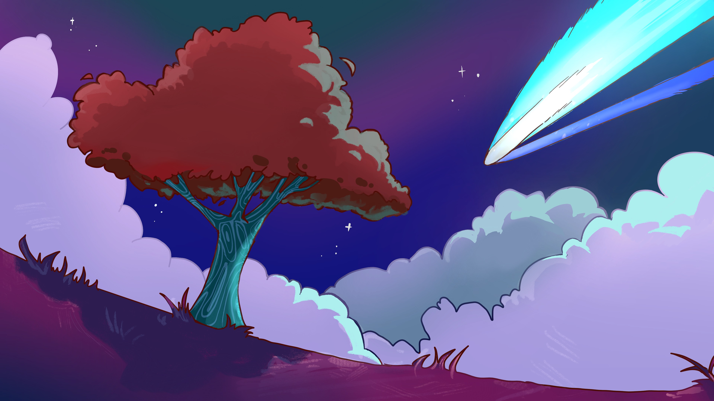
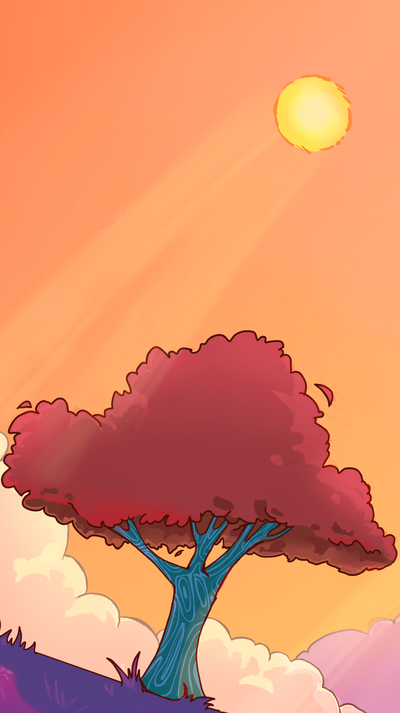
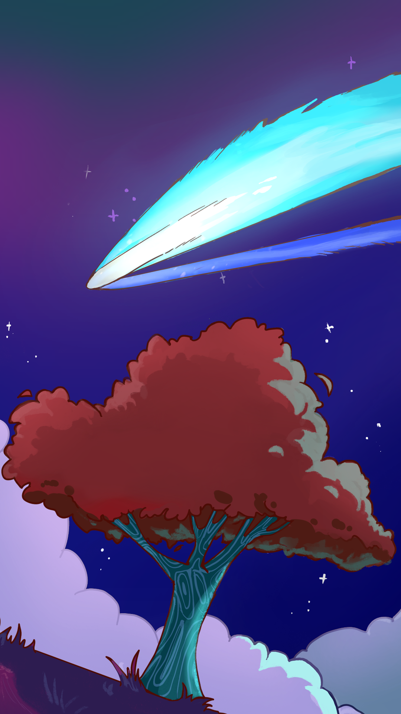

<a data-fancybox="kde6-wallpapers" href="../assets/img/post/kde6-wallpapers/screenshot-from-kde-megarelease6.png">

> Screenshot from [KDE MegaRelease6](https://kde.org/announcements/megarelease/6/){:target="blank"}

KDE6 更新了很多东西，我最喜欢的竟然是新增的壁纸「Scarlet Tree」，它有 light 和 dark 两种风格，还有适用于手机的分辨率。壁纸位于`/usr/share/wallpapers/Next/contents/`.

开始欣赏壁纸吧！

> Transform your desktop with the mesmerizing 'Scarlet Tree' wallpaper by axo1otl. Capture the dynamic interplay between the sun's vibrant energy and the comet's celestial dance.

<a data-fancybox="kde6-wallpapers" href="../assets/img/post/kde6-wallpapers/light.png">

<a data-fancybox="kde6-wallpapers" href="../assets/img/post/kde6-wallpapers/dark.png">

<a data-fancybox="kde6-wallpapers" href="../assets/img/post/kde6-wallpapers/light-mobile.png">

<a data-fancybox="kde6-wallpapers" href="../assets/img/post/kde6-wallpapers/dark-mobile.png">
