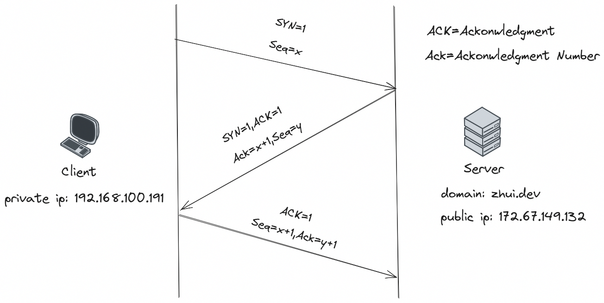
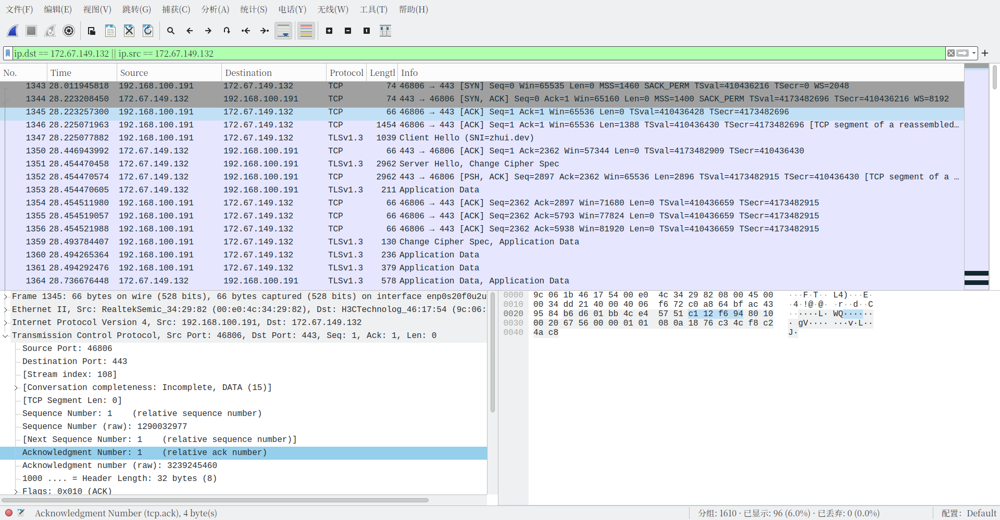

TCP 三次握手看过很多次了，当时也是理解了，但是总是忘记。比如这次，又忘了，所有来抓包加深记忆和理解，要是还忘了，就来这儿看看:joy:

抓包工具本来想试试 termshark 来着，因为没用过，但是中途内存泄漏被 earlyoom 杀死了，还是用 wireshark.

<span class="spoiler" >earlyoom 的通知怎么又好了（</span>

<a data-fancybox="capture-tcp-3-way-handshake" href="../assets/img/post/capture-tcp-3-way-handshake/system-notify.png">

如果你也不喜欢 systemd-oomd 试试 [earlyoom](https://github.com/rfjakob/earlyoom).

```
earlyoom[454]: Will avoid killing process names that match regex '(^|/)(init|systemd|Xorg|sshd)$'
earlyoom[454]: mem total: 7721 MiB, swap total: 7720 MiB
earlyoom[454]: sending SIGTERM when mem <= 10.00% and swap <= 10.00%,
earlyoom[454]:         SIGKILL when mem <=  5.00% and swap <=  5.00%
earlyoom[454]: mem avail:  7072 of  7721 MiB (91.60%), swap free: 7720 of 7720 MiB (100.00%)
earlyoom[454]: mem avail:   554 of  7721 MiB ( 7.18%), swap free:  742 of 7720 MiB ( 9.62%)
earlyoom[454]: low memory! at or below SIGTERM limits: mem 10.00%, swap 10.00%
earlyoom[454]: sending SIGTERM to process 9994 uid 1000 "termshark": badness 1181, VmRSS 4568 MiB
earlyoom[454]: escalating to SIGKILL after 2.8 seconds
earlyoom[454]: process exited after 2.8 seconds

```

好像偏题了。

开始抓包，抓取的是访问博客产生的包，下面的 NO.1343, NO.1344, NO.1345 这三条产生的 [SYN], [SYN, ACK], [ACK] 三个包分别对应三次握手的过程，

<a data-fancybox="capture-tcp-3-way-handshake" href="../assets/img/post/capture-tcp-3-way-handshake/img01.png">

先回忆一下 TCP 三次握手过程，简单画了个图：

<a data-fancybox="capture-tcp-3-way-handshake" href="../assets/img/post/capture-tcp-3-way-handshake/img02.png">

结合上面两张图分析 TCP 三次握手：

1. [SYN]：客户端向服务器发送一个 SYN 包来发起主动连接，客户端将数据包的序列号 Seq 设置为一个随机数 x. 此时，标志位 SYN = 1, 序列号 Seq = x.
2. [SYN, ACK]：服务器回应一个 [SYN, ACK] 包。确认号 Ack 被设置为接收到的序列号加 1，即 x + 1，服务器的数据包序列号 Seq 设置为另一个随机数 y。此时，标志位 SYN = 1, 标志位 ACK = 1, 确认号 Ack = x + 1, 序列号 Seq = y.
3. [ACK]：最后，客户端向服务器发送一个 ACK 包。数据包的序列号 Seq 被设置为接收到的确认号 Ack，即 x + 1，确认号 Ack 被设置为接收到的序列号加 1，即 y + 1。此时，标志位 ACK = 1, 序列号 Seq = x + 1, 确认号 Ack = y + 1.

理论分析完毕。

接下来逐条分析 [SYN]，[SYN, ACK]，[ACK] 三个包中的各个值是否和上述一致。

第一次握手：客户端 `192.168.100.191` 发送了一个 [SYN] 包给服务端 `172.67.149.132`，此时，Seq = `0x4ce45750`, Flags: (SYN).

<a data-fancybox="capture-tcp-3-way-handshake" href="../assets/img/post/capture-tcp-3-way-handshake/img03.png">

第二次握手：服务端 `172.67.149.132`收到 [SYN] 包，回应了一个 [SYN, ACK] 包给客户端 `192.168.100.191`，此时，Ack = `0x4ce45751`, Seq = `0xc112f693`,Flags: (SYN, ACK).

<a data-fancybox="capture-tcp-3-way-handshake" href="../assets/img/post/capture-tcp-3-way-handshake/img04.png">

<a data-fancybox="capture-tcp-3-way-handshake" href="../assets/img/post/capture-tcp-3-way-handshake/img05.png">

第三次握手：最后，客户端 `192.168.100.191` 回应一个 [ACK] 包，此时，Ack = `0xc112f694`, Seq = `0x4ce45751`, Flags: (ACK).

<a data-fancybox="capture-tcp-3-way-handshake" href="../assets/img/post/capture-tcp-3-way-handshake/img06.png">

<a data-fancybox="capture-tcp-3-way-handshake" href="../assets/img/post/capture-tcp-3-way-handshake/img07.png">

客户端服务器建立连接完成。

之前见过一个 TCP 相关的笑话来着，找不到了:upside_down_face:
