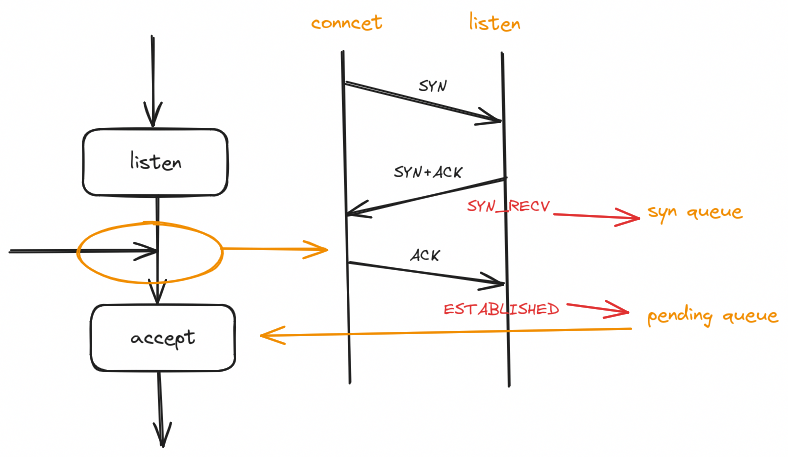

* TOC
{:toc}
## man 2 listen

先从手册看看描述：

```
DESCRIPTION
       listen() marks the socket referred to by sockfd as a passive socket, that is, as a socket that will be
       used to accept incoming connection requests using accept(2).

       The  sockfd  argument  is  a  file descriptor that refers to a socket of type SOCK_STREAM or SOCK_SEQ‐
       PACKET.

       The backlog argument defines the maximum length to which the queue of pending connections  for  sockfd
       may  grow.   If  a  connection request arrives when the queue is full, the client may receive an error
       with an indication of ECONNREFUSED or, if the underlying protocol supports retransmission, the request
       may be ignored so that a later reattempt at connection succeeds.

```

从描述中可以知道，`listen()` 将 `sockfd` 引用的套接字标记为被动套接字，可以在上面调用 `accept()` 。

在后面的注意事项中有这样一段话：

```
NOTES
       The  behavior  of  the  backlog  argument on TCP sockets changed with Linux 2.2.  Now it specifies the
       queue length for completely established sockets waiting to be accepted, instead of the number  of  in‐
       complete connection requests.  The maximum length of the queue for incomplete sockets can be set using
       /proc/sys/net/ipv4/tcp_max_syn_backlog.   When  syncookies  are  enabled  there  is no logical maximum
       length and this setting is ignored.  See tcp(7) for more information.

       If the backlog argument is greater than the value in /proc/sys/net/core/somaxconn, then it is silently
       capped to that value.  Since Linux 5.4, the default in this file is 4096; in earlier kernels, the  de‐
       fault value is 128.  Before Linux 2.4.25, this limit was a hard coded value, SOMAXCONN, with the value
       128.
```

这说明调用`listen()`时内核维护了两个队列 —— “未完全建立连接队列”和“完全建立连接队列”。

再回到函数原型：

```c
int listen(int sockfd, int backlog);
```

参数 `sockfd` 是一个已经创建的套接字描述符，而 `backlog` 则表示服务器端能够接受的完全建立的套接字连接队列的最大长度。

## 两个队列和三次握手

TCP 通信过程如下图：

<a data-fancybox="tcp-listen" href="../assets/img/post/tcp-listen/tcp-socket.png">

三次握手发生在系统调用 `connect()`,`listen()`阶段：

 <a data-fancybox="tcp-listen" href="../assets/img/post/tcp-listen/tcp-socket-3whs.png">

- syn queue - 用于存储 SYN_RECV 状态的连接
- pending queue - 用于存储 ESTABLISHED 状态的连接

客户端调用 `connect()` 发起连接，发送了第一次握手的 SYN 包，服务器回了 SYN+ACK 包，此时的连接（SYN_RECV 状态）会放在 syn queue，服务器收到最后一个 ACK 包完成三次握手完成后的连接（ESTABLISHED 状态）放在 pending queue ，等待 `accept()` 调用出队。

### 测试程序和抓包

下面是一个验证 TCP 三次握手发生在`connect()`,`listen()`阶段的简单示例：

 client.c

```c
#include <arpa/inet.h>
#include <netinet/in.h>
#include <stdio.h>
#include <stdlib.h>
#include <strings.h>
#include <sys/socket.h>
#include <unistd.h>

int main(int argc, char *argv[]) {
  int sockfd = socket(AF_INET, SOCK_STREAM, 0);
  if (-1 == sockfd) {
    perror("socket");
  }

  struct sockaddr_in server_addr;
  bzero(&server_addr, sizeof(server_addr));
  server_addr.sin_family = AF_INET;
  server_addr.sin_addr.s_addr = inet_addr(argv[1]);
  server_addr.sin_port = htons(atoi(argv[2]));

  int ret = connect(sockfd, (struct sockaddr *)&server_addr, sizeof(server_addr));
  if (-1 == ret) {
    perror("connect");
  } else {
    printf("conneted\n");
  }
  close(sockfd);
  return 0;
}

```

server.c

```c
#include <arpa/inet.h>
#include <netinet/in.h>
#include <stdio.h>
#include <stdlib.h>
#include <strings.h>
#include <sys/socket.h>
#include <unistd.h>

int main(int argc, char *argv[]) {
  int sockfd = socket(AF_INET, SOCK_STREAM, 0);
  if (-1 == sockfd) {
    perror("socket");
  }

  struct sockaddr_in server_addr;
  bzero(&server_addr, sizeof(server_addr));
  server_addr.sin_family = AF_INET;
  server_addr.sin_addr.s_addr = inet_addr(argv[1]);
  server_addr.sin_port = htons(atoi(argv[2]));

  int ret = bind(sockfd, (struct sockaddr *)&server_addr, sizeof(server_addr));
  if (-1 == ret) {
    perror("bind");
  }

  ret = listen(sockfd, 33);
  if (-1 == ret) {
    perror("listen");
  }

  sleep(10); // 留给抓包的时间
  close(sockfd);
  return 0;
}

```

先运行 server

```
➜ ./server 192.168.100.191 33333
```

再抓包

```
➜ sudo tcpdump -i any port 33333
```

最后用 client 连接 server

```
➜ ./client 192.168.100.191 33333
```

可以看到抓包的输出

```
➜ sudo tcpdump -i any port 33333
tcpdump: data link type LINUX_SLL2
tcpdump: verbose output suppressed, use -v[v]... for full protocol decode
listening on any, link-type LINUX_SLL2 (Linux cooked v2), snapshot length 262144 bytes
15:17:50.191602 lo    In  IP venus.38172 > venus.dgi-serv: Flags [SEW], seq 3952710686, win 33280, options [mss 65495,nop,nop,sackOK,nop,wscale 10], length 0
15:17:50.191625 lo    In  IP venus.dgi-serv > venus.38172: Flags [S.E], seq 2291194089, ack 3952710687, win 33280, options [mss 65495,nop,nop,sackOK,nop,wscale 10], length 0
15:17:50.191652 lo    In  IP venus.38172 > venus.dgi-serv: Flags [.], ack 1, win 33, length 0
```

1. `Flags [SEW]`: 表示这是一个 SYN、ECE 和 CWR 标志位被置位的数据包。
2. `Flags [S.E]`: 表示这是一个 SYN/ACK 包，同时 ECE 标志被置位。
3. `Flags [.]`: 表示这是一个 ACK 包，客户端收到了服务器端的 SYN/ACK 包，并确认建立了连接。

## 协议攻击

SYN 泛洪，在 DDoS 中属于 TCP 协议攻击，针对的是 syn queue.

### 对策

增大 syn queue 最大长度：

```
net.ipv4.tcp_max_syn_backlog = 8192
```

相关阅读：

- [https://www.cloudflare.com/learning/ddos/syn-flood-ddos-attack](https://www.cloudflare.com/learning/ddos/syn-flood-ddos-attack/)
- [https://zh.wikipedia.org/wiki/SYN_flood](https://zh.wikipedia.org/wiki/SYN_flood)
- [https://wiki.archlinux.org/title/Sysctl#Tweak_the_pending_connection_handling](https://wiki.archlinux.org/title/Sysctl#Tweak_the_pending_connection_handling)


## 参考资料

1. man 2 listen
1. [https://stackoverflow.com/questions/12893379/listen-queue-length-in-socket-programing-in-c](https://stackoverflow.com/questions/12893379/listen-queue-length-in-socket-programing-in-c)
