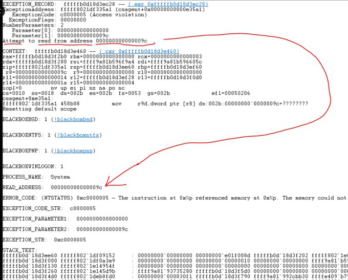

* TOC
{:toc}
## 前言

作为一名没有多少经验的 C/C++ 程序员，我曾经对空指针检查存在一些轻视。每当看到类似这样的代码：

```c++
void do_Something(SomeClass* ptr) {
    if (ptr == nullptr) {
        // ...
        return;
    }
    // ...
}
```

我常常会想："这种检查是不是有些多余？谁会传一个空指针进来呢？就算真的传了空指针，程序崩溃一次，重新运行一下也没什么大不了的。"

现在回想起来，这种想法确实有些欠考虑。直到最近 Crowdstrike 事件发生后，我才真正意识到这个问题的严重性。

在 X 上看到了 Zach Vorhies 对 Crowdstrike 事件的分析，我认为有必要记录一下。**以下所有内容都转自[这篇帖子](https://x.com/Perpetualmaniac/status/1814376668095754753)。**

TL;DR

> It was a NULL pointer from the memory unsafe C++ language.

## 正文

C++ 程序员在传递对象时应该检查是否为空。通常你会看到这样的代码：

```cpp
string* p = get_name();
if (p == NULL) {
    print("Could not get name");
}
```

string* 部分表示我们有一个指向字符串值开始的"指针"。如果它是为空，那么就没有东西，不要尝试访问它。

让我们以一个包含内容的通用对象为例：

```cpp
struct Obj {
    int a;
    int b;
};
```

如果我们创建一个指向它的指针：

```cpp
Obj* obj = new Obj();
```

我们可以得到它的起始地址，假设是一个随机的值，比如 0x9030=36912（我使用小数字）。那么：

- obj 的地址是 0x9030
- obj->a 的地址是 0x9030 + 0x4
- obj->b 的地址是 0x9030 + 0x8

每个成员都是从起始地址的偏移量。

现在假设以下情况：

```cpp
Obj* obj = NULL;
```

那么：

- obj 的地址是 0
- obj->a 的地址是 0 + 4
- obj->b 的地址是 0 + 8

所以如果我在一个空指针上执行这个操作：

```cpp
print(obj->a);
```

程序会产生像如下图所示的 stack dump。它无法读取值 0x000000004。

<a data-fancybox="nullptr" href="../assets/img/post/nullptr/GS3s-OgasAE_Z9d.jpg">

在上面这个 stack dump 中，你可以看到它试图读取内存值 0x9c，转为十进制是 156。所以发生的情况是，程序员忘记检查它正在使用的对象是否有效，它试图访问对象的一个成员变量...

NULL + 0x9C = 0x9C = 156，这是一个无效的内存区域。更糟糕的是，**这是一个系统驱动程序的特殊程序**，它对计算机有特权访问权。因此操作系统被迫立即崩溃。

这就是导致蓝屏死机的原因。计算机可以通过简单地终止程序来从非特权代码的崩溃中恢复，但不能从系统驱动程序的崩溃中恢复。当你的计算机崩溃时，95% 的情况是因为系统驱动程序崩溃。

## 总结

不要小看空指针啊喂！